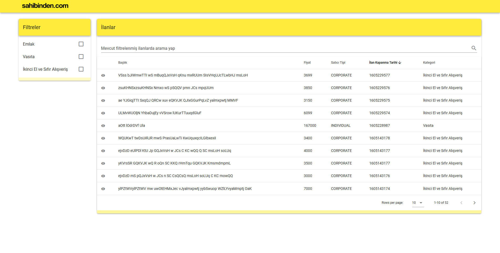
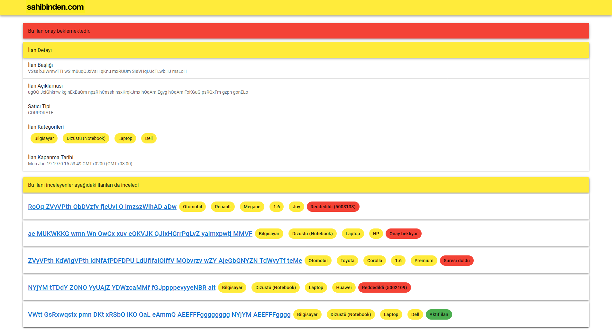

# barisbuvan - dev.akademi2020

# Ne amaçlandı?
MEVN (MongoDB, Express.js, Vue.js, Node.js) stacki kullanılarak ML destekli fullstack bir listeleme uygulaması yapmak amaçlandı. 
Ufak da olsa ML katmak için collaborative-filter kütüphanesini kullanarak "Bu ilanı inceleyenler aşağıdaki ilanları da inceledi" kısmını geliştirdim (ilan detay sayfasında aşağıda görülebilir; anasayfadaki ilanların yanındaki göze tıklanmalı detay görmek için).
Bunlara ek olarak cache için Redis ve containerization için Docker kullanıldı. 

Daha detaylı açıklamalar:
./server/helpers/previously-visited (collaborative filtering burada)
./server/helpers/cache-setter
./server/middlewares/cache




# Yani genel olarak neler var içeride?
1. Collaborative filtering 
2. MEVN
3. Caching (Redis)
4. Containerization (Docker)
5. Request logging (morgan)

# Neyi, neden yapmadım, yapamadım? Neler yapsam daha iyi olurdu?

1. Test yazmak iyi (harika) olurdu fakat vaktim kalmadığı (ve daha geliştirmek istediğim featureler olduğu için) yazamadım.
2. Dümdüz comment yazmak yerine belki JSDoc?
3. Belki GraphQL olabilirdi fakat daha önce kullanmadığım ve bilgim kısıtlı olduğu için yanaşmadım.
4. Swagger ile API dokümantasyonu
5. Filtering, sorting, pagination gibi manipülasyonları front end tarafında datatable componentine bel bağlamak yerine back end tarafında manipüle edebilirdim, öylesi çok daha lightweight ve zengin olurdu.
6. ...

# Nasıl çalıştırırım?

Projenin root klasöründeyken ```docker-compose up --force``` komutunu çalıştırın.
Front end için ```http://localhost:8080```'i ziyaret edin.
Back end için ```http://localhost:8000```'i ziyaret edin.